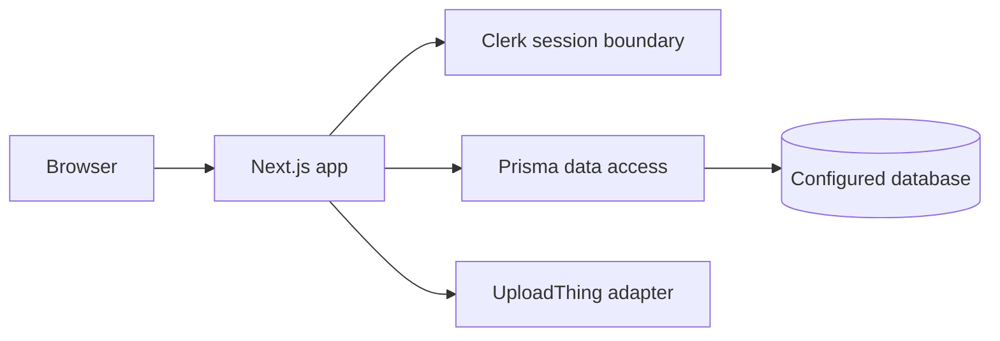

# Next Social

Next Social is a learning-oriented social application prototype built with Next.js, TypeScript, Prisma, Clerk, and UploadThing. The repository contains the application skeleton, relational schema, migrations, and UI components for profiles, posts, follows, and uploads.

## Maturity

This is a portfolio/learning project, not a maintained public service. The README previously contained the stock Next.js starter text; the implementation itself is more substantial but deployment configuration and hosted behavior were not independently verified during this audit.

## Local setup

```bash
npm install
npx prisma generate
npm run dev
```

The app requires provider-specific environment variables for Clerk, the database, and UploadThing. Keep them in an untracked local environment file and configure allowed origins and upload policies in any non-local deployment.

## Architecture



## Limitations

- No current production URL or deployment guarantee is claimed.
- Authentication, authorization, moderation, rate limiting, and upload controls must be reviewed before a shared deployment.
- The project is kept public as a learning prototype; it is not part of the primary GenAI/data portfolio selection.
